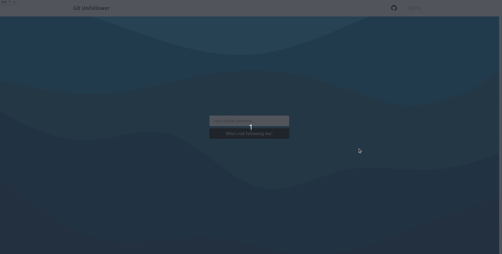

# Git Unfollower

> Git Unfollower is a simple app to find out who's not following you back on Github! :sunglasses: All of the data used is public data provided by the Github API.

## Check it out on Heroku

For now, all that you have to do is to type your Github username and click on the button! There'll be OAuth Login in the future to get this data automatically.

## Built With

- Ruby
- Ruby on Rails
- Bulma Framework
- Remix Icon
- Unique Gems: rest-client, json

## A quick reflection - What is the purpose of this tool?

The sole purpose of this tool is informational - so you can see, compare and analyze the data and do whatever seems fit to you.

#### Should I unfollow those who don't follow me?

Not necessarily. You can follow people or tools that you like and admire, but unfortunately, the feeling might not be mutual - which is perfectly fine! You are great and beautiful in your own way. Please don't let this affect you!

But you can check if, for example, someone who wanted to "exchange follows" with you have done their part of their work, and maybe even (POLITELY!) ask for them to do so! Or maybe you can just use this data to try to better understand what people who do not follow you. For example, what is the kind of works/programmers that they admire?

Do not use this tool for evil purposes, you hot bum!

## Check out Git Unfollower

[Check it out on Heroku](https://git-unfollower.herokuapp.com/)

## Getting Started

### Prerequisites

- Ruby
- Bundler
- Ruby on Rails
- Node.js
- Yarn (v >= 1.2 && < 2)

### Setup

- Create a new folder/directory for the project
- Be sure to have a Github account and that this account is connected locally on your PC

### Install

Run this commands in this order:

To clone the project into your computer:
- `git clone https://github.com/fernandorpm/git-unfollower.git`

To install the gems from the Gemfile.lock:
- `bundle install`

To start the server locally (http://127.0.0.1:3000/)
- `rails s`

### Troubleshooting

#### Error "Webpacker::Manifest::MissingEntryError" on starting application

- stop the web app
- run `bundle exec rake webpacker:install`
- run `rails s`

### Deployment

:warning: This project is authorial, and therefore should not be deployed without the creator's permission. :warning:

## Author

👤 **Fernando R P Marques**

- GitHub: [@fernandorpm](https://github.com/fernandorpm)
- Twitter: [@rpm_fernando](https://twitter.com/rpm_fernando)
- LinkedIn: [Fernando R P Marques](https://linkedin.com/in/fernandorpm)

## 🤝 Contributing

Contributions, issues, and feature requests are welcome!

Feel free to check the [issues page](../../issues/).

## Show your support

Give a ⭐️ if you like this project!

## 📝 License

This project is [MIT](./MIT.md) licensed.
